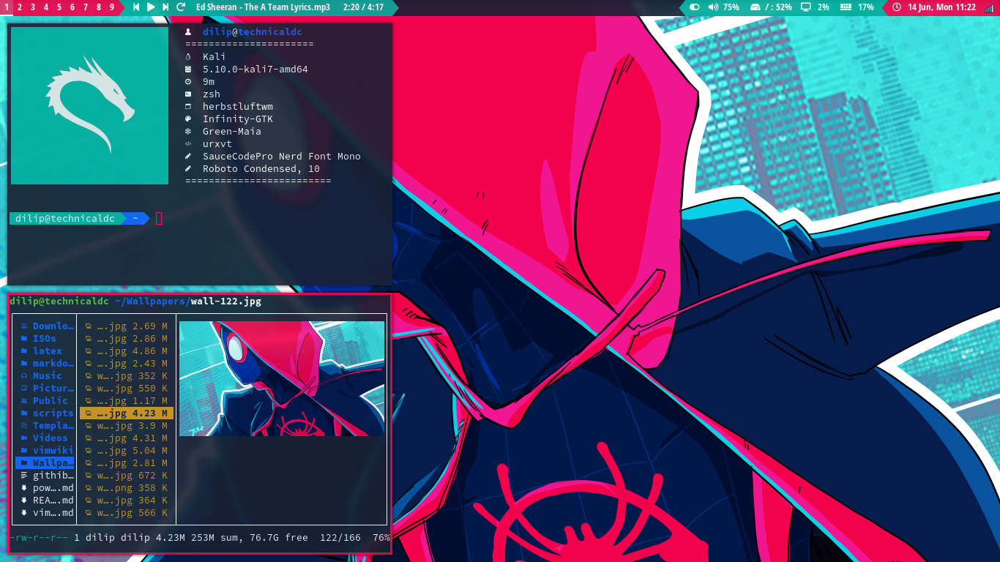
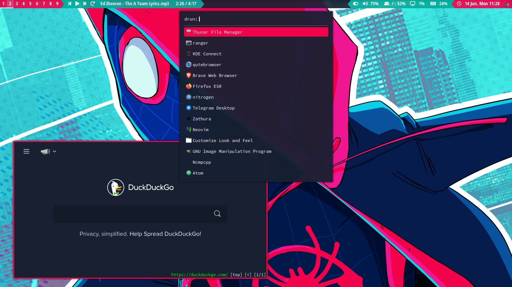
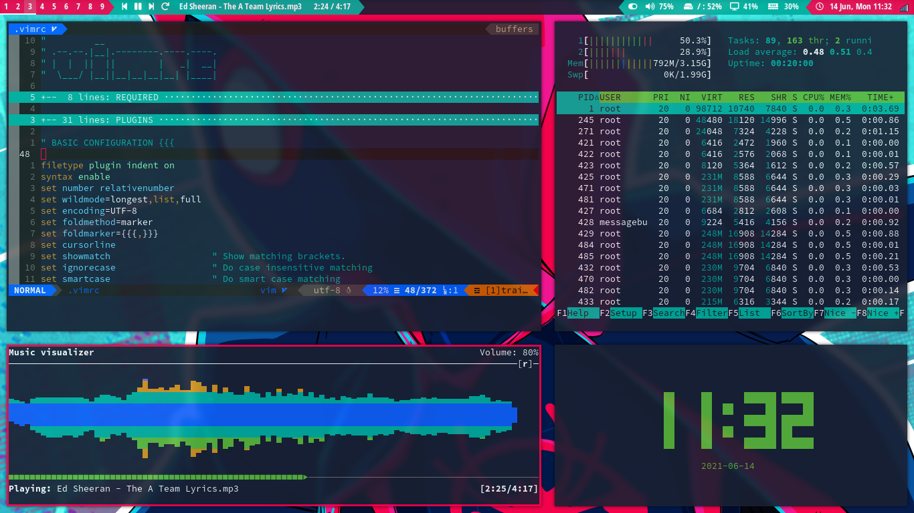

# My Dotfiles

- Bspwm
- Dunst
- Herbstluftwm        
- i3-gaps
- Mpd
- Mpv
- Ncmpcpp
- Neofetch
- Picom
- Polybar
- Qtile
- Qutebrowser
- Ranger
- Rofi
- Sxhkd
- Sxiv ( with key handler)
- Urxvt
- Vim/Neovim
- Xresources
- Zathura

# Screenshots:

